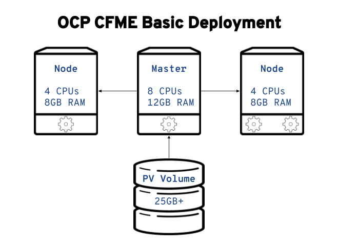

# OpenShift-Ansible - CFME Role

# PROOF OF CONCEPT - Alpha Version

This role is based on the work in the upstream
[manageiq/manageiq-pods](https://github.com/ManageIQ/manageiq-pods)
project. For additional literature on configuration specific to
ManageIQ (optional post-installation tasks), visit the project's
[upstream documentation page](http://manageiq.org/docs/get-started/basic-configuration).

Please submit a
[new issue](https://github.com/openshift/openshift-ansible/issues/new)
if you run into bugs with this role or wish to request enhancements.

# Important Notes

This is an early *proof of concept* role to install the Cloud Forms
Management Engine (ManageIQ) on OpenShift Container Platform (OCP).

* This role is still in **ALPHA STATUS**
* Many options are hard-coded still (ex: NFS setup)
* Not many configurable options yet
* **Should** be ran on a dedicated cluster
* **Will not run** on undersized infra
* The terms *CFME* and *MIQ* / *ManageIQ* are interchangeable

## Requirements

**NOTE:** These requirements are copied from the upstream
[manageiq/manageiq-pods](https://github.com/ManageIQ/manageiq-pods)
project.

### Prerequisites:

*
  [OpenShift Origin 1.5](https://docs.openshift.com/container-platform/3.5/welcome/index.html)
  or
  [higher](https://docs.openshift.com/container-platform/latest/welcome/index.html)
  provisioned
* NFS or other compatible volume provider
* A cluster-admin user (created by role if required)

### Cluster Sizing

In order to avoid random deployment failures due to resource
starvation, we recommend a minimum cluster size for a **test**
environment.

| Type           | Size    | CPUs     | Memory   |
|----------------|---------|----------|----------|
| Masters        | `1+`    | `8`      | `12GB`   |
| Nodes          | `2+`    | `4`      | `8GB`    |
| PV Storage     | `25GB`  | `N/A`    | `N/A`    |




**CFME has hard-requirements for memory. CFME will NOT install if your
  infrastructure does not meet or exceed the requirements given
  above. Do not run this playbook if you do not have the required
  memory, you will just waste your time.**


### Other sizing considerations

* Recommendations assume MIQ will be the **only application running**
  on this cluster.
* Alternatively, you can provision an infrastructure node to run
  registry/metrics/router/logging pods.
* Each MIQ application pod will consume at least `3GB` of RAM on initial
  deployment (blank deployment without providers).
* RAM consumption will ramp up higher depending on appliance use, once
  providers are added expect higher resource consumption.


### Assumptions

1) You meet/exceed the [cluster sizing](#cluster-sizing) requirements
1) Your NFS server is on your master host
1) Your PV backing NFS storage volume is mounted on `/exports/`

Required directories that NFS will export to back the PVs:

* `/exports/miq-pv0[123]`

If the required directories are not present at install-time, they will
be created using the recommended permissions per the
[upstream documentation](https://github.com/ManageIQ/manageiq-pods#make-persistent-volumes-to-host-the-miq-database-and-application-data):

* UID/GID: `root`/`root`
* Mode: `0775`

**IMPORTANT:** If you are using a separate volume (`/dev/vdX`) for NFS
  storage, **ensure** it is mounted on `/exports/` **before** running
  this role.


## Role Variables

Core variables in this role:

| Name                          | Default value | Description   |
|-------------------------------|---------------|---------------|
| `openshift_cfme_install_app`  | `False`       | `True`: Install everything and create a new CFME app, `False`: Just install all of the templates and scaffolding |


Variables you may override have defaults defined in
[defaults/main.yml](defaults/main.yml).


# Important Notes

This is a **tech preview** status role presently. Use it with the same
caution you would give any other pre-release software.

**Most importantly** follow this one rule: don't re-run the entrypoint
playbook multiple times in a row without cleaning up after previous
runs if some of the CFME steps have ran. This is a known
flake. Cleanup instructions are provided at the bottom of this README.


# Usage

This section describes the basic usage of this role. All parameters
will use their [default values](defaults/main.yml).

## Pre-flight Checks

**IMPORTANT:** As documented above in [the prerequisites](#prerequisites),
  you **must already** have your OCP cluster up and running.

**Optional:** The ManageIQ pod is fairly large (about 1.7 GB) so to
save some spin-up time post-deployment, you can begin pre-pulling the
docker image to each of your nodes now:

```
root@node0x # docker pull docker.io/manageiq/manageiq-pods:app-latest-fine
```

## Getting Started

1) The *entry point playbook* to install CFME is located in
[the BYO playbooks](../../playbooks/byo/openshift-cfme/config.yml)
directory

2) Update your existing `hosts` inventory file and ensure the
parameter `openshift_cfme_install_app` is set to `True` under the
`[OSEv3:vars]` block.

2) Using your existing `hosts` inventory file, run `ansible-playbook`
with the entry point playbook:

```
$ ansible-playbook -v -i <INVENTORY_FILE> playbooks/byo/openshift-cfme/config.yml
```

## Next Steps

Once complete, the playbook will let you know:


```
TASK [openshift_cfme : Status update] *********************************************************
ok: [ho.st.na.me] => {
    "msg": "CFME has been deployed. Note that there will be a delay before it is fully initialized.\n"
}
```

This will take several minutes (*possibly 10 or more*, depending on
your network connection). However, you can get some insight into the
deployment process during initialization.

### oc describe pod manageiq-0

*Some useful information about the output you will see if you run the
`oc describe pod manageiq-0` command*

**Readiness probe**s - These will take a while to become
`Healthy`. The initial health probes won't even happen for at least 8
minutes depending on how long it takes you to pull down the large
images. ManageIQ is a large application so it may take a considerable
amount of time for it to deploy and be marked as `Healthy`.

If you go to the node you know the application is running on (check
for `Successfully assigned manageiq-0 to <HOST|IP>` in the `describe`
output) you can run a `docker pull` command to monitor the progress of
the image pull:

```
[root@cfme-node ~]# docker pull docker.io/manageiq/manageiq-pods:app-latest-fine
Trying to pull repository docker.io/manageiq/manageiq-pods ...
sha256:6c055ca9d3c65cd694d6c0e28986b5239ba56bbdf0488cccdaa283d545258f8a: Pulling from docker.io/manageiq/manageiq-pods
Digest: sha256:6c055ca9d3c65cd694d6c0e28986b5239ba56bbdf0488cccdaa283d545258f8a
Status: Image is up to date for docker.io/manageiq/manageiq-pods:app-latest-fine
```

The example above demonstrates the case where the image has been
successfully pulled already.

If the image isn't completely pulled already then you will see
multiple progress bars detailing each image layer download status.


### rsh

*Useful inspection/progress monitoring techniques with the `oc rsh`
command.*


On your master node, switch to the `cfme` project (or whatever you
named it if you overrode the `openshift_cfme_project` variable) and
check on the pod states:

```
[root@cfme-master01 ~]# oc project cfme
Now using project "cfme" on server "https://10.10.0.100:8443".

[root@cfme-master01 ~]# oc get pod
NAME                 READY     STATUS    RESTARTS   AGE
manageiq-0           0/1       Running   0          14m
memcached-1-3lk7g    1/1       Running   0          14m
postgresql-1-12slb   1/1       Running   0          14m
```

Note how the `manageiq-0` pod says `0/1` under the **READY**
column. After some time (depending on your network connection) you'll
be able to `rsh` into the pod to find out more of what's happening in
real time. First, the easy-mode command, run this once `rsh` is
available and then watch until it says `Started Initialize Appliance
Database`:

```
[root@cfme-master01 ~]# oc rsh manageiq-0 journalctl -f -u appliance-initialize.service
```

For the full explanation of what this means, and more interactive
inspection techniques, keep reading on.

To obtain a shell on our `manageiq` pod we use this command:

```
[root@cfme-master01 ~]# oc rsh manageiq-0 bash -l
```

The `rsh` command opens a shell in your pod for you. In this case it's
the pod called `manageiq-0`. `systemd` is managing the services in
this pod so we can use the `list-units` command to see what is running
currently: `# systemctl list-units | grep appliance`.

If you see the `appliance-initialize` service running, this indicates
that basic setup is still in progress. We can monitor the process with
the `journalctl` command like so:


```
[root@manageiq-0 vmdb]# journalctl -f -u appliance-initialize.service
Jun 14 14:55:52 manageiq-0 appliance-initialize.sh[58]: == Checking deployment status ==
Jun 14 14:55:52 manageiq-0 appliance-initialize.sh[58]: No pre-existing EVM configuration found on region PV
Jun 14 14:55:52 manageiq-0 appliance-initialize.sh[58]: == Checking for existing data on server PV ==
Jun 14 14:55:52 manageiq-0 appliance-initialize.sh[58]: == Starting New Deployment ==
Jun 14 14:55:52 manageiq-0 appliance-initialize.sh[58]: == Applying memcached config ==
Jun 14 14:55:53 manageiq-0 appliance-initialize.sh[58]: == Initializing Appliance ==
Jun 14 14:55:57 manageiq-0 appliance-initialize.sh[58]: create encryption key
Jun 14 14:55:57 manageiq-0 appliance-initialize.sh[58]: configuring external database
Jun 14 14:55:57 manageiq-0 appliance-initialize.sh[58]: Checking for connections to the database...
Jun 14 14:56:09 manageiq-0 appliance-initialize.sh[58]: Create region starting
Jun 14 14:58:15 manageiq-0 appliance-initialize.sh[58]: Create region complete
Jun 14 14:58:15 manageiq-0 appliance-initialize.sh[58]: == Initializing PV data ==
Jun 14 14:58:16 manageiq-0 appliance-initialize.sh[58]: == Initializing PV data backup ==
Jun 14 14:58:16 manageiq-0 appliance-initialize.sh[58]: sending incremental file list
Jun 14 14:58:16 manageiq-0 appliance-initialize.sh[58]: created directory /persistent/server-deploy/backup/backup_2017_06_14_145816
Jun 14 14:58:16 manageiq-0 appliance-initialize.sh[58]: region-data/
Jun 14 14:58:16 manageiq-0 appliance-initialize.sh[58]: region-data/var/
Jun 14 14:58:16 manageiq-0 appliance-initialize.sh[58]: region-data/var/www/
Jun 14 14:58:16 manageiq-0 appliance-initialize.sh[58]: region-data/var/www/miq/
Jun 14 14:58:16 manageiq-0 appliance-initialize.sh[58]: region-data/var/www/miq/vmdb/
Jun 14 14:58:16 manageiq-0 appliance-initialize.sh[58]: region-data/var/www/miq/vmdb/REGION
Jun 14 14:58:16 manageiq-0 appliance-initialize.sh[58]: region-data/var/www/miq/vmdb/certs/
Jun 14 14:58:16 manageiq-0 appliance-initialize.sh[58]: region-data/var/www/miq/vmdb/certs/v2_key
Jun 14 14:58:16 manageiq-0 appliance-initialize.sh[58]: region-data/var/www/miq/vmdb/config/
Jun 14 14:58:16 manageiq-0 appliance-initialize.sh[58]: region-data/var/www/miq/vmdb/config/database.yml
Jun 14 14:58:16 manageiq-0 appliance-initialize.sh[58]: server-data/
Jun 14 14:58:16 manageiq-0 appliance-initialize.sh[58]: server-data/var/
Jun 14 14:58:16 manageiq-0 appliance-initialize.sh[58]: server-data/var/www/
Jun 14 14:58:16 manageiq-0 appliance-initialize.sh[58]: server-data/var/www/miq/
Jun 14 14:58:16 manageiq-0 appliance-initialize.sh[58]: server-data/var/www/miq/vmdb/
Jun 14 14:58:16 manageiq-0 appliance-initialize.sh[58]: server-data/var/www/miq/vmdb/GUID
Jun 14 14:58:16 manageiq-0 appliance-initialize.sh[58]: sent 1330 bytes  received 136 bytes  2932.00 bytes/sec
Jun 14 14:58:16 manageiq-0 appliance-initialize.sh[58]: total size is 770  speedup is 0.53
Jun 14 14:58:16 manageiq-0 appliance-initialize.sh[58]: == Restoring PV data symlinks ==
Jun 14 14:58:16 manageiq-0 appliance-initialize.sh[58]: /var/www/miq/vmdb/REGION symlink is already in place, skipping
Jun 14 14:58:16 manageiq-0 appliance-initialize.sh[58]: /var/www/miq/vmdb/config/database.yml symlink is already in place, skipping
Jun 14 14:58:16 manageiq-0 appliance-initialize.sh[58]: /var/www/miq/vmdb/certs/v2_key symlink is already in place, skipping
Jun 14 14:58:16 manageiq-0 appliance-initialize.sh[58]: /var/www/miq/vmdb/log symlink is already in place, skipping
Jun 14 14:58:28 manageiq-0 systemctl[304]: Removed symlink /etc/systemd/system/multi-user.target.wants/appliance-initialize.service.
Jun 14 14:58:29 manageiq-0 systemd[1]: Started Initialize Appliance Database.
```

Most of what we see here (above) is the initial database seeding
process. This process isn't very quick, so be patient.

At the bottom of the log there is a special line from the `systemctl`
service, `Removed symlink
/etc/systemd/system/multi-user.target.wants/appliance-initialize.service`. The
`appliance-initialize` service is no longer marked as enabled. This
indicates that the base application initialization is complete now.

We're not done yet though, there are other ancillary services which
run in this pod to support the application. *Still in the rsh shell*,
Use the `ps` command to monitor for the `httpd` processes
starting. You will see output similar to the following when that stage
has completed:

```
[root@manageiq-0 vmdb]# ps aux | grep http
root       1941  0.0  0.1 249820  7640 ?        Ss   15:02   0:00 /usr/sbin/httpd -DFOREGROUND
apache     1942  0.0  0.0 250752  6012 ?        S    15:02   0:00 /usr/sbin/httpd -DFOREGROUND
apache     1943  0.0  0.0 250472  5952 ?        S    15:02   0:00 /usr/sbin/httpd -DFOREGROUND
apache     1944  0.0  0.0 250472  5916 ?        S    15:02   0:00 /usr/sbin/httpd -DFOREGROUND
apache     1945  0.0  0.0 250360  5764 ?        S    15:02   0:00 /usr/sbin/httpd -DFOREGROUND
```

Furthermore, you can find other related processes by just looking for
ones with `MIQ` in their name:

```
[root@manageiq-0 vmdb]# ps aux | grep miq
root        333 27.7  4.2 555884 315916 ?       Sl   14:58   3:59 MIQ Server
root       1976  0.6  4.0 507224 303740 ?       SNl  15:02   0:03 MIQ: MiqGenericWorker id: 1, queue: generic
root       1984  0.6  4.0 507224 304312 ?       SNl  15:02   0:03 MIQ: MiqGenericWorker id: 2, queue: generic
root       1992  0.9  4.0 508252 304888 ?       SNl  15:02   0:05 MIQ: MiqPriorityWorker id: 3, queue: generic
root       2000  0.7  4.0 510308 304696 ?       SNl  15:02   0:04 MIQ: MiqPriorityWorker id: 4, queue: generic
root       2008  1.2  4.0 514000 303612 ?       SNl  15:02   0:07 MIQ: MiqScheduleWorker id: 5
root       2026  0.2  4.0 517504 303644 ?       SNl  15:02   0:01 MIQ: MiqEventHandler id: 6, queue: ems
root       2036  0.2  4.0 518532 303768 ?       SNl  15:02   0:01 MIQ: MiqReportingWorker id: 7, queue: reporting
root       2044  0.2  4.0 519560 303812 ?       SNl  15:02   0:01 MIQ: MiqReportingWorker id: 8, queue: reporting
root       2059  0.2  4.0 528372 303956 ?       SNl  15:02   0:01 puma 3.3.0 (tcp://127.0.0.1:5000) [MIQ: Web Server Worker]
root       2067  0.9  4.0 529664 305716 ?       SNl  15:02   0:05 puma 3.3.0 (tcp://127.0.0.1:3000) [MIQ: Web Server Worker]
root       2075  0.2  4.0 529408 304056 ?       SNl  15:02   0:01 puma 3.3.0 (tcp://127.0.0.1:4000) [MIQ: Web Server Worker]
root       2329  0.0  0.0  10640   972 ?        S+   15:13   0:00 grep --color=auto -i miq
```

Finally, *still in the rsh shell*, to test if the application is
running correctly, we can request the application homepage. If the
page is available the page title will be `ManageIQ: Login`:

```
[root@manageiq-0 vmdb]# curl -s -k https://localhost | grep -A2 '<title>'
<title>
ManageIQ: Login
</title>
```

**Note:** The `-s` flag makes `curl` operations silent and the `-k`
flag to ignore errors about untrusted certificates.


# Additional Upstream Resources

Below are some useful resources from the upstream project
documentation. You may find these of value.

* [Verify Setup Was Successful](https://github.com/ManageIQ/manageiq-pods#verifying-the-setup-was-successful)
* [POD Access And Routes](https://github.com/ManageIQ/manageiq-pods#pod-access-and-routes)
* [Troubleshooting](https://github.com/ManageIQ/manageiq-pods#troubleshooting)


# Manual Cleanup

At this time uninstallation/cleanup is still a manual process. You
will have to follow a few steps to fully remove CFME from your
cluster.

Delete the project:

* `oc delete project cfme`

Delete the PVs:

* `oc delete pv miq-pv01`
* `oc delete pv miq-pv02`
* `oc delete pv miq-pv03`

Clean out the old PV data:

* `cd /exports/`
* `find miq* -type f -delete`
* `find miq* -type d -delete`

Remove the NFS exports:

* `rm /etc/exports.d/openshift_cfme.exports`
* `exportfs -ar`

Delete the user:

* `oc delete user cfme`

**NOTE:** The `oc delete project cfme` command will return quickly
however it will continue to operate in the background. Continue
running `oc get project` after you've completed the other steps to
monitor the pods and final project termination progress.
